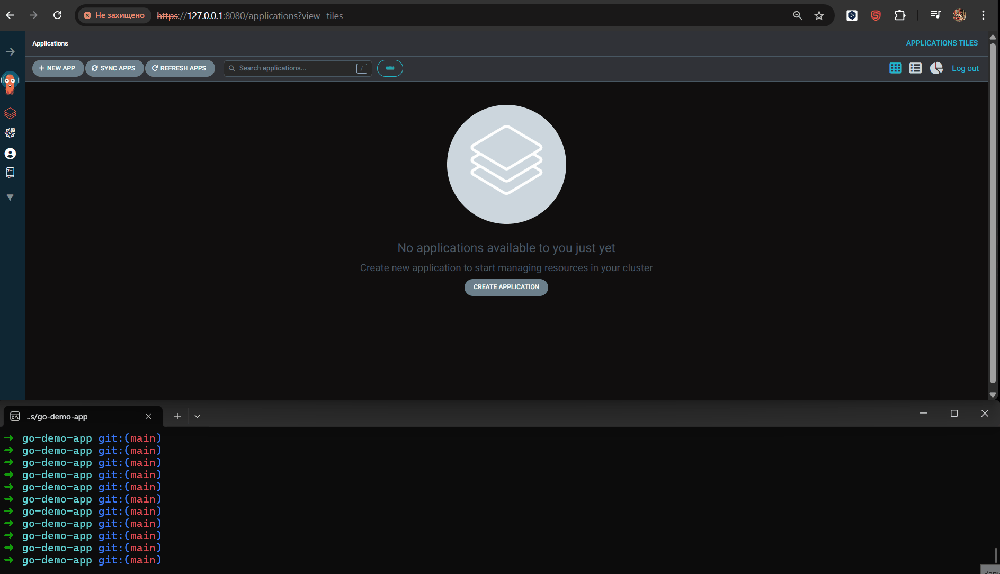

# Configuring an Application in cluster with Argo CD

Below is a brief guide to creating an application in Argo CD and verifying that it works.

## Creating an Application in the Argo CD GUI with Manual Sync


1. In the Argo CD web UI, click **NEW APP**.
2. **Application Name** — enter your app name (e.g., `go-demo-app`).
3. **Project Name** — `default`.
4. **Sync Policy** - Manual
5. Enable **Auto-Create Namespace**.
6. **Repository URL** — the repository with your manifests: `https://github.com/kors-dev/go-demo-app`.
7. **Path** — path to the manifests in the repo (e.g., `k8s/` or another relevant folder).
8. **Cluster URL** — `https://kubernetes.default.svc`.
9. **Namespace** — specify the target namespace (if **Auto-Create Namespace** is enabled, Argo CD will create it if it doesn't exist).
10. Click **Create**.
11. After the app is created, click **Sync** and wait until **APP HEALTH** becomes **Healthy**.
12. After pushing changes to your repository, click **Refresh** in Argo CD. If the status is **OutOfSync**, click **Sync** to force synchronization.

## Creating an Application in the Argo CD GUI with Auto Sync



1. In the Argo CD web UI, click **NEW APP**.
2. **Application Name** — enter your app name (e.g., `go-demo-app`).
3. **Project Name** — `default`.
4. **Sync Policy** - Auto
5. Enable **Auto-Create Namespace**, **Enable Auto-Sync**, **rune Resources**, **Self Heal**.
6. **Repository URL** — the repository with your manifests: `https://github.com/kors-dev/go-demo-app`.
7. **Path** — path to the manifests in the repo (e.g., `k8s/` or another relevant folder).
8. **Cluster URL** — `https://kubernetes.default.svc`.
9. **Namespace** — specify the target namespace (if **Auto-Create Namespace** is enabled, Argo CD will create it if it doesn't exist).
10. Click **Create** and ArgoCD will automatically start synchronization.
11. After pushing changes to your repository (Optional: click **Refresh** in Argo CD)  ArgoCD will automatically start synchronization

## Verifying the Application


1. Port-forward to the API Gateway service (e.g., `ambassador`):

```bash
kubectl port-forward -n demo svc/ambassador 8081:80
```

2. Download a test image (JPEG) **into the current directory**:


```bash
wget -O ./flower.jpg 'https://upload.wikimedia.org/wikipedia/commons/3/3f/JPEG_example_flower.jpg'
```

3. Upload the image to your app via the API:

```bash
curl -F 'image=@./flower.jpg;type=image/jpeg' 'http://localhost:8081/img/'
```
