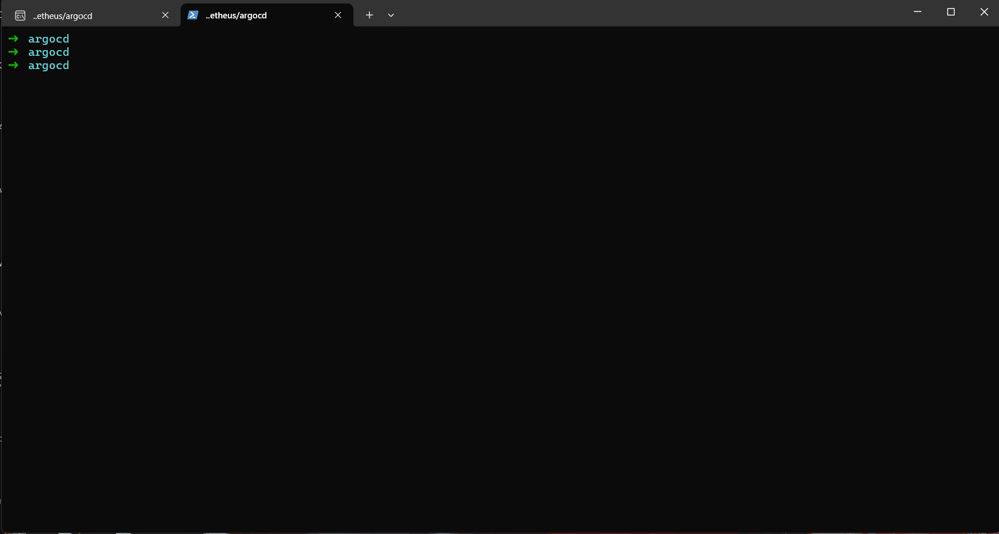
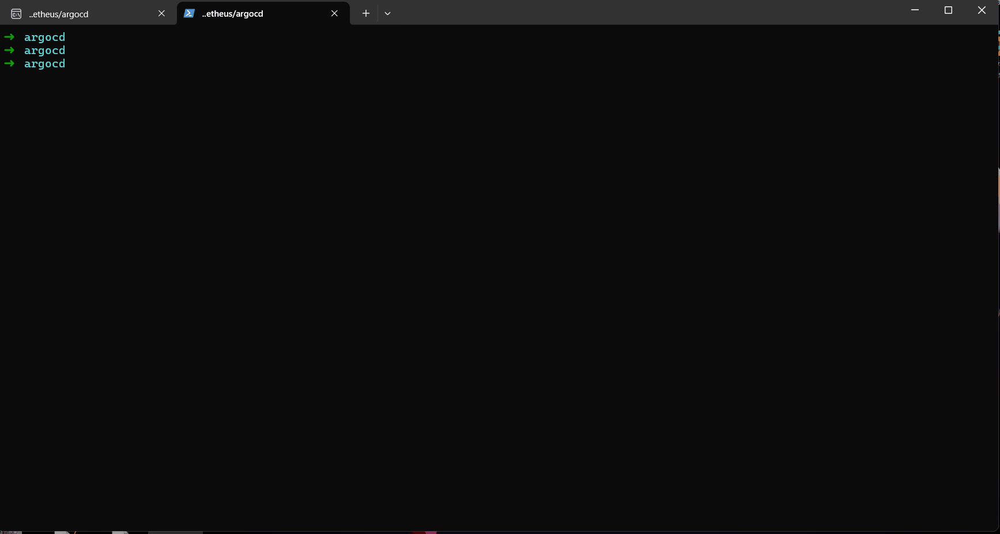
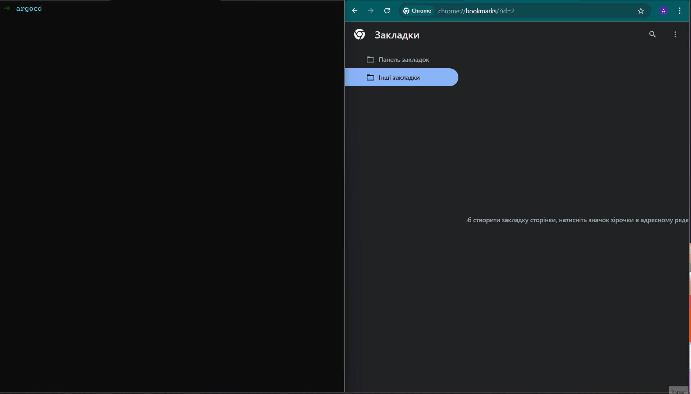
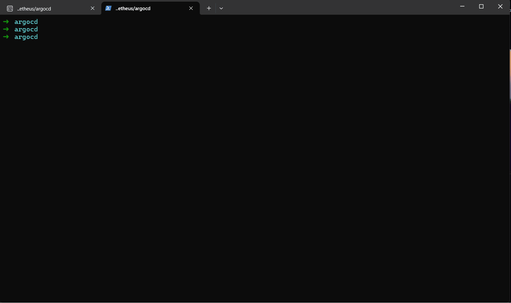

# Kubernetes Cluster Setup with k3d and ArgoCD

This guide covers:
1. Creating a Kubernetes cluster using **k3d**
2. Creating a namespace for your application
3. Installing **ArgoCD**
4. Accessing the ArgoCD Web UI
5. Managing and deleting the cluster

---

## 1. Create a Kubernetes Cluster with k3d




Create a new cluster named `asciiartify`:
```bash
k3d cluster create asciiartify
```

Verify the cluster status and resources:
```bash
kubectl cluster-info
kubectl version
kubectl get all -A
```

---

## 2. Create a Namespace for the Application



Namespaces help isolate workloads and resources in Kubernetes.

```bash
kubectl create namespace asciiartify-dev
kubectl get ns
```

---

## 3. Install ArgoCD


It’s recommended to install ArgoCD in a dedicated namespace called `argocd`.

### 3.1 Create the ArgoCD namespace
```bash
kubectl create namespace argocd
```

### 3.2 Install ArgoCD manifests
```bash
kubectl apply -n argocd -f https://raw.githubusercontent.com/argoproj/argo-cd/stable/manifests/install.yaml
```

### 3.3 Check ArgoCD resources
```bash
kubectl get all -n argocd
```

### 3.4 Wait for all pods to be ready
```bash
kubectl get pod -n argocd -w
```

---

## 4. Access the ArgoCD Web UI



### 4.1 Port-forward for local access
```bash
kubectl port-forward svc/argocd-server -n argocd 8080:443 &
```

Open your browser at:
```
https://127.0.0.1:8080
```
> Accept the self-signed certificate warning.

---

### 4.2 Retrieve the Initial Admin Password

Default username:
```
admin
```

Command to get the password:
```bash
kubectl -n argocd get secret argocd-initial-admin-secret   -o jsonpath="{.data.password}" | base64 -d; echo
```

---

## 5. Next Steps

---

## 6. Useful Commands



List all clusters and contexts:
```bash
kubectl config get-clusters
kubectl config get-contexts
```

Switch to a specific context:
```bash
kubectl config use-context k3d-asciiartify
```

Delete the k3d cluster:
```bash
k3d cluster delete asciiartify
```


